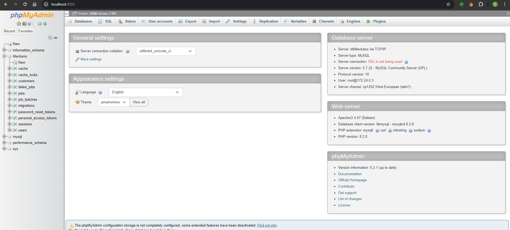

# Meckano test:

1) I have use Laravel and installed it's api service:

   > > php artisan install:api

2) These are the API routes I have added in the server

**php artisan** route:list

> #### GET|HEAD api/customers ................... CustomerController@index
>#### POST api/customers ................... CustomerController@store
>#### GET|HEAD api/customers/search ........... CustomerController@search
>#### PUT api/customers/{id} ............. CustomerController@update
>#### DELETE api/customers/{id} ................ CustomerController@destroy
>#### POST api/login ........................... AuthController@login
>#### POST api/logout ......................... AuthController@logout
>#### POST api/register ........................ AuthController@register
>#### POST api/user ........................... AuthController@user
>#### GET|HEAD sanctum/csrf-cookie .............sanctum.csrf-cookie › Laravel\Sanctum › CsrfCookieController@show
>

3) I have tested all of the route myself using Postman .
   You could add swagger(on the frontend) to the project and also check these more easily.
   

4) Authentication
   Login and Register: Use the auth:sanctum middleware to secure your routes.
   JWT: Pass the JWT token in the Authorization: Bearer <token> header in requests.
4) Frontend
   The frontend is built using React and communicates with the backend API using Axios. Basic navigation includes login,
   registration, and customer management pages.
   
   
   
5) Add phpmyadmin on port 8080 to view the db
   user:root
   password:root

6) installing
   Navigate to the backend and frontend directories to install dependencies:

   #### For backend:
   [bash]
   > cd backend
   >
   > composer install
   >
   > php artisan serve --host=0.0.0.0 --port=8000

   #### For frontend:

   [bash]

         > cd frontend
         > npm install
         > npm run

6) Bckend .env example:

> > APP_NAME=Laravel
> > APP_ENV=local
> > APP_KEY=base64:uRdteg4904mMlcTGnjQcKfuhrSGSL9GgG9myvdqP6vI=
> > APP_DEBUG=true
> > APP_TIMEZONE=UTC
> > APP_URL=http://localhost

> > APP_LOCALE=en
> > APP_FALLBACK_LOCALE=en
> > APP_FAKER_LOCALE=en_US

> > APP_MAINTENANCE_DRIVER=file

> > BCRYPT_ROUNDS=12

> > LOG_CHANNEL=stack
> > LOG_STACK=single
> > LOG_DEPRECATIONS_CHANNEL=null
> > LOG_LEVEL=debug

> > DB_CONNECTION=mysql
> > #DB_HOST=dbMeckano #prod
> > DB_HOST=localhost
> > DB_PORT=3306
> > DB_DATABASE=Meckano
> > DB_USERNAME=root
> > DB_PASSWORD=root

> > SESSION_DRIVER=database
> > SESSION_LIFETIME=120
> > SESSION_ENCRYPT=false
> > SESSION_PATH=/
> > SESSION_DOMAIN=null

> > BROADCAST_CONNECTION=log
> > FILESYSTEM_DISK=local
> > QUEUE_CONNECTION=database

> > CACHE_DRIVER=database
> > CACHE_PREFIX=laravel_cache

> > MEMCACHED_HOST=127.0.0.1

> > REDIS_CLIENT=phpredis
> > REDIS_HOST=127.0.0.1
> > REDIS_PASSWORD=null
> > REDIS_PORT=6379

> > MAIL_MAILER=log
> > MAIL_HOST=127.0.0.1
> > MAIL_PORT=2525
> > MAIL_USERNAME=null
> > MAIL_PASSWORD=null
> > MAIL_ENCRYPTION=null
> > MAIL_FROM_ADDRESS="hello@example.com"
> > MAIL_FROM_NAME="${APP_NAME}"

> > AWS_ACCESS_KEY_ID=
> > AWS_SECRET_ACCESS_KEY=
> > AWS_DEFAULT_REGION=us-east-1
> > AWS_BUCKET=
> > AWS_USE_PATH_STYLE_ENDPOINT=false

> > VITE_APP_NAME="${APP_NAME}"
*/

8) Debugging
   [VS Code]
   Install the PHP Debug extension.
   Set up .vscode/launch.json for debugging with Xdebug.

[PHPStorm]
Configure Xdebug with Docker by setting up the server and remote debugging settings.

10) Security Practices
11) Input Validation: Implement server-side validation to prevent SQL injection and XSS attacks.
12) Authentication: Use JWT tokens for secure API access.
13) Sanitization: Ensure data is sanitized when entering and leaving the system.
14) Docker Support

> > PS C:\Projects\PHP\Meckano\meckano> docker-compose down

time="2024-09-11T19:22:49+03:00" level=warning msg="C:

    \\Projects\\PHP\\Meckano\\meckano\\docker-compose.yml: `version` is obsolete"

    [+] Running 5/5

    ✔ Container phpmyadmin_container Removed 1.6s

    ✔ Container meckano-frontend-1 Removed 0.1s

    ✔ Container meckano-backend-1 Removed 0.1s

    ✔ Container meckano-dbMeckano-1 Removed 2.4s

    ✔ Network meckano_app Removed

--------------------------------------------
> > docker-compose up

time="2024-09-11T19:26:51+03:00" level=warning msg="C:\\Projects\\PHP\\Meckano\\meckano\\docker-compose.yml: `version`
is obsolete"

[+] Running 5/5

✔ Network meckano_app Created 0.1s

✔ Container meckano-dbMeckano-1 Created 0.1s

✔ Container phpmyadmin_container Created 0.2s

✔ Container meckano-backend-1 Created 0.2s

✔ Container meckano-frontend-1 Created 0.1s

Attaching to backend-1, dbMeckano-1, frontend-1, phpmyadmin_container

dbMeckano-1 | 2024-09-11T16:26:53.269026Z
--------------------------

used docker-compose dockefiles and entry.sh to build the images:

### docker-compose.yml

{
version: '3.8'

services:
backend:
build:
context: ./backend
dockerfile: Dockerfile
environment:
DB_HOST: dbMeckano
DB_DATABASE: Meckano
DB_USERNAME: root
DB_PASSWORD: root
depends_on:

- dbMeckano
  ports:
    - "8000:8000"
      networks:
    - app

frontend:
build:
context: ./frontend
dockerfile: Dockerfile
tty: true
ports:

- "3000:3000"
  volumes:
    - ./frontend:/app/frontend
      depends_on:
    - backend
      networks:
    - app

dbMeckano:
image: mysql:5.7.22
environment:
MYSQL_DATABASE: Meckano
MYSQL_USER: root
MYSQL_PASSWORD: root
MYSQL_ROOT_PASSWORD: root
volumes:

- mysql_data:/var/lib/mysql
  ports:
    - "3306:3306"
      networks:
    - app

phpmyadmin:
image: phpmyadmin/phpmyadmin
container_name: phpmyadmin_container
depends_on:

- dbMeckano
  ports:
    - "8080:80"
      environment:
      PMA_HOST: dbMeckano
      PMA_PORT: 3306
      PMA_USER: root
      PMA_PASSWORD: root
      networks:
    - app

networks:
app:
driver: bridge

volumes:
mysql_data:
}

The project is fully containerized using Docker Compose. All services, including Laravel, MySQL, and the React frontend,
run in separate containers.

15 )

Troubleshooting
Route Not Found: Ensure routes are defined correctly in routes/web.php or routes/api.php.
Database Connection Issues: Check that environment variables match the Docker service names.
Xdebug Not Working: Ensure the correct configuration in your php.ini and IDE settings.

16) Contributing
    Fork the repository.
    Create a new feature branch.
    Commit your changes.
    Push to the branch.
    Open a pull request.
17) License
    This project is licensed under the MIT License.

Contact
For any questions or suggestions, please contact Dror Golan at drorgolan76@gmail.com.

# **comments**

## TEST - backend/frontend

#### not included not fully completed